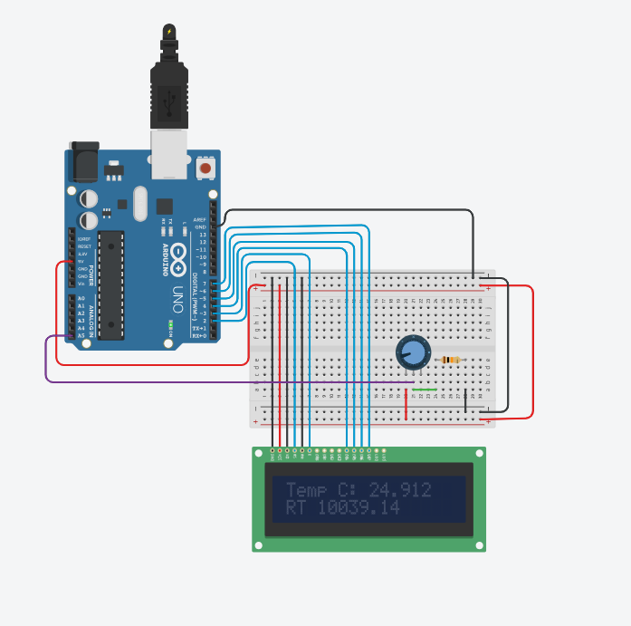
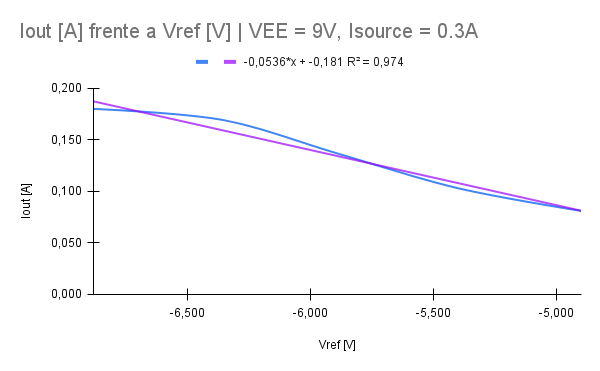
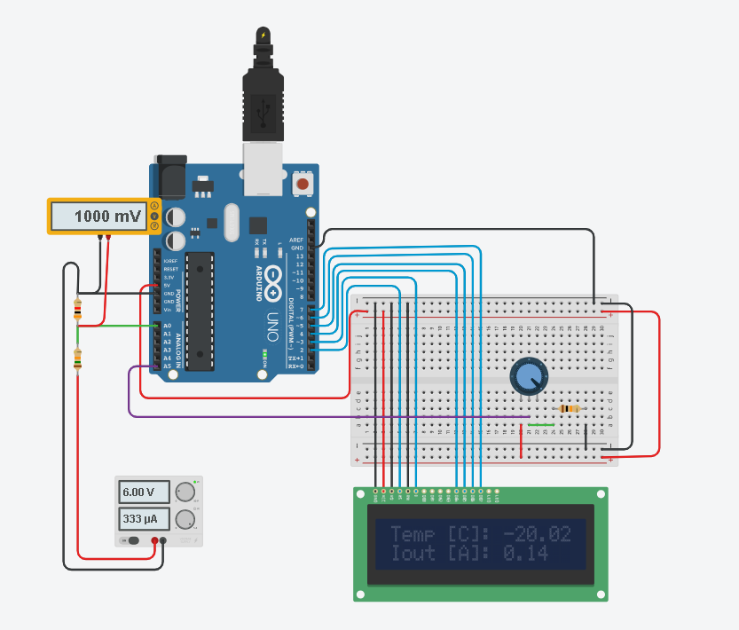
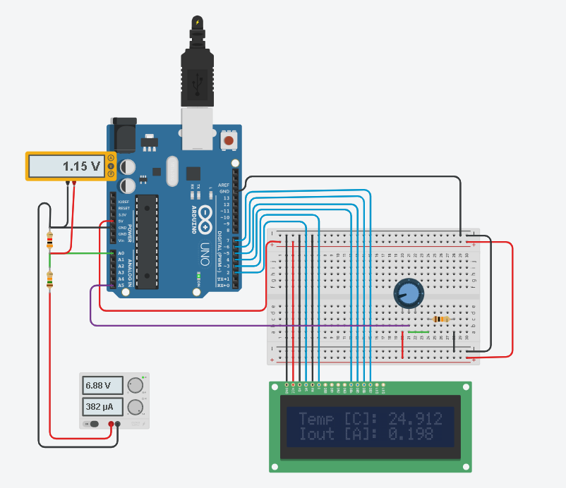
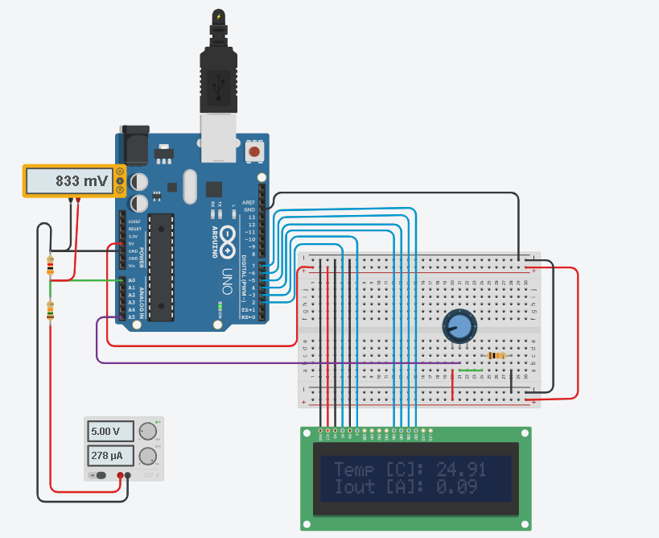

## Interfaces de de visualización de temperatura y corriente
#### objetivos

- Crear una interfaz utilizando Arduino donde se pueda leer el valor de temperatura del diodo láser a partir del valor resistivo del termistor.
- Crear una interfaz utilizando Arduino donde se pueda leer el valor de corriente del diodo láser, utilizando un sensor ACS712

## Interfaz para control de `temperatura`

Se realizó inicialmente una simulación en TinkerCAD, donde se plantea una serie de pasos para lograr el objetivo final

+ ### Paso 1 `Conexión con pantalla LCD`
  La forma de conectar la pantalla LCD al arduino, es conectando los pines como se muestra en la tabla
  
| **Pines LCD** | **Pines Arduino** |
|:-------------:|:-----------------:|
|      GND      |        GND        |
|      VCC      |         5V        |
|       VD      |        GND        |
|       RS      |     Digital 2     |
|       RW      |        GND        |
|       E       |     Digital 3     |
|      DB4      |     Digital 4     |
|      DB5      |     Digital 5     |
|      DB6      |     Digital 6     |
|      DB7      |     Digital 7     |

    
+ ### Paso 2  `Lectura del valor resistivo del termistor`
  Para leer el valor resistivo del termistor en arduino, se parte de un divisor de tensión, con un resistor conocido $R_k$ y la resistencia del termistor $R_T$. De modo que:

$$V_{out} = V_{in} (\frac{R_k}{R_T + R_k})$$

Entonces:

$$ R_T = R_k(\frac{V_{in}}{V_{out}}-1) $$

Si se utiliza un pin analogico en modo lectura en el arduino para leer la tensión de salida, entonces se puede calcular dentro del código fácilmente el valor resistivo, la configuración en Arduino es la siguiente:

  

+ ### Paso 3  `Conversion de resistencia a temperatura`
Normalmente para un termistor NTC se utilizan dos algoritmos

+ #### Ecuación de Steinhart-Hart:
Consiste en tomar 3 valores de resistencia del termistor y la temperatura medida, en este proyecto se utiliza la tabla de resistencia vs temperatura que provee la hoja de datos Hy5640, se trata de tomar las medidas que se observan más claras para mayor precisión.
- Gráfica de variación de la resistencia respecto a la temperatura 10k dale termistor
  

	
| Valores medidos | R k $\Omega$ | T $C^o$ |
|-----------------|:-----------:|--------:|
| R1 \| T1        |      10     |      25 |
| R2 \| T2        |      25     |       5 |
| R3 \| T3        |     100     |     -20 |

Luego se calculan los parametros A, B y C de la ecuación de La Steinhart-Hart para poder computar el comportamiento del termistor.

$$\frac{1}{T} = A + Bln(R)+C[ln(R)^3]$$

Para hallar los valores de A, B y C. Se requiere solucionar el sistema de ecuaciones 3x3

$$\begin{bmatrix} 1 \ \ ln(R_1) \ \ ln^3(R_1) \\\ 1 \ \ ln(R_2) \ \ ln^3(R_2) \\\ 1 \ \ ln(R_3) \ \ ln^3(R_3) \end{bmatrix}\cdot \begin{bmatrix} A \\\ B \\\ C \end{bmatrix} = \begin{bmatrix} \frac{1}{T_1} \\\ \frac{1}{T_1} \\\ \frac{1}{T_1}\end{bmatrix} $$ 

#### Ecuación del parámetro beta
Para utilizar la ecuación del parametro beta, se requieren dos valores de resistencia del termistor y de temperatura medida, de igual forma que en la ecuación de Steinhart-Hart, se utilizan dos de los tres valores de la tabla. La resistencia y temperatura se relacionan mediante la ecuación:

$$\frac{1}{T} = \frac{1}{T_0} + \frac{1}{\beta}ln(\frac{R_T}{R_0})$$

Y el valor de $\beta$ se calcula utilizando los dos pares ordenados (T,R), tales que:

$$\beta = \frac{ln(\frac{R1}{R2})}{\frac{1}{T_1}-\frac{1}{T_2}}$$

Finalmente, se puede utilizar un software que haga este calculo, por ejemplo  [SRS Thermistor Calculator](https://www.thinksrs.com/downloads/programs/therm%20calc/ntccalibrator/ntccalculator.html)

Se obtuvieron estos valores para los parametros del termistor NTC dale 10k dada la curva

- Obtención de los parametros de Stainhart-Hart y beta

+ ### Resultados  `Simulación del diseño en TinkerCAD`
  Se logró modelar correctamente el comportamiento del termistor de 10k como se muestra en la siguiente figura, donde se modela mediante un potenciometro, la variación de resistencia del termistor y se muestra la temperatura respectiva.
  - Lecturas de temperatura
  

  

  
## Interfaz para control de `temperatura`
+ ### Contexto
Para realizar un sensor de corriente en TinkerCAD para el Hy6340, se utilizó el pín 8 del controlador, llamado Vref, esta salida se relaciona directamente con la corriente de salida Iout, entonces queda sencillo leer Vref en el arduino y realizar la conversión internamente con código de Vref a Iout.
+ ### Correlación de Vref con Iout
De acuerdo con las mediciones realizadas en el laboratorio, la relación Iout es la siguiente.

  
  
+ ### Configuración en TinkerCAD
  
En TinkerCAD, se agrega una fuente de tensión para simular la tensión de salida Vref y un divisor de tensión, ya que arduino recibe tensiones de 5V máximo. Se utiliza una resistencia de 15k y otra de 3k para reducir la tension de entrada en factor de 1/6

$$V_{medida} = V_{in} (\frac{3k}{3k + 15k}) = V_{in} \frac{1}{6} $$

Luego, dentro del código, simplemente se multiplica la tensión medida en un factor de 6 y se obtiene la lectura deseada. Con este valor, se procede a calcular la corriente de salida del diodo láser con la ecuación obtenida en el punto anterior. Recordando que la tensión Vref inicialmente es negativa con respecto a GND, por lo que se propone conectar a GND de Arduino Vref, y en la entrada analogica A0 conectar GND del Hy6340. La idea es compensar este signo dentro del código de Arduino. Entonces

$$I_{out} = 0.0536*(V_{ref}) -0.181$$
+ ### Resultados  `Simulación del diseño en TinkerCAD`
Así se logra realizar mediciones coherentes aunque no tan precisas en algunos puntos, como se puede ver en la imagen.

